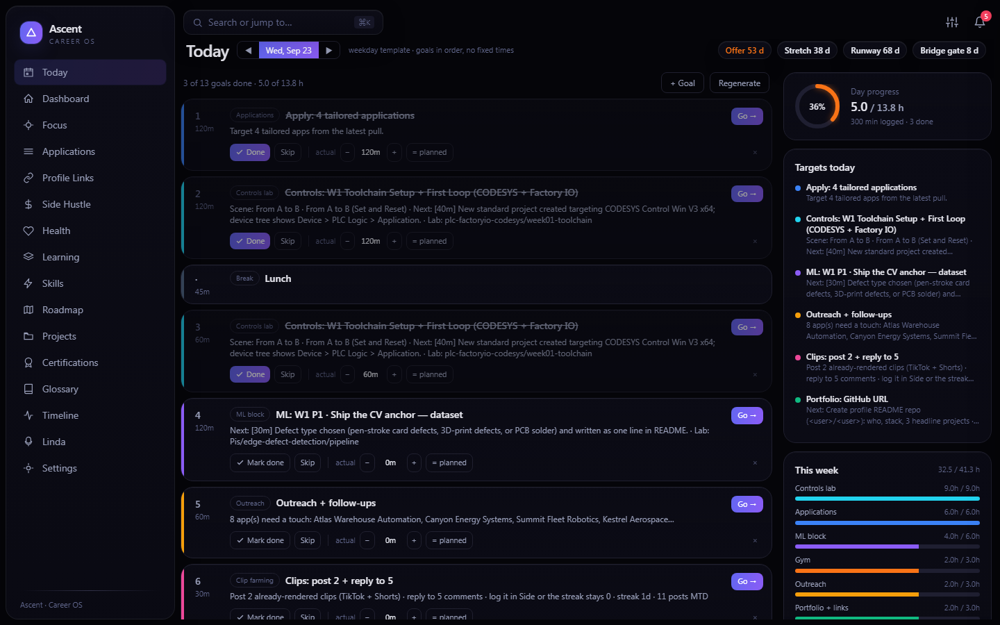
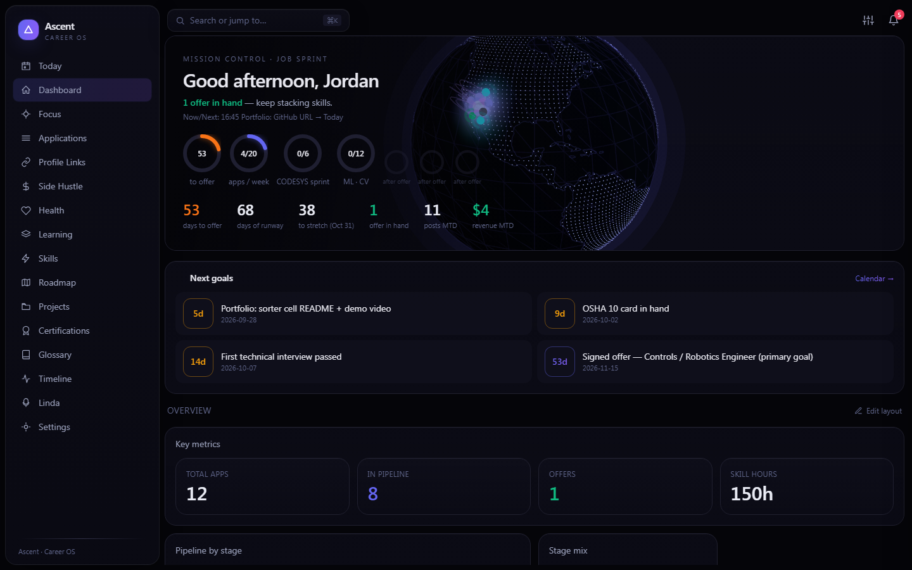
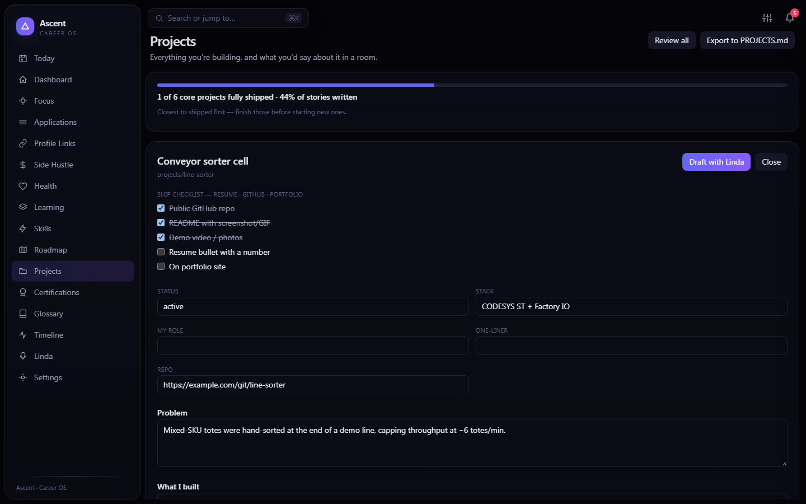
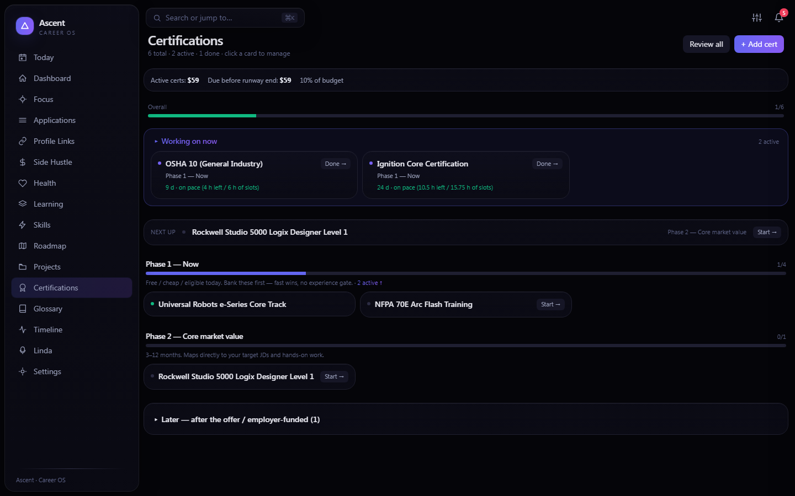
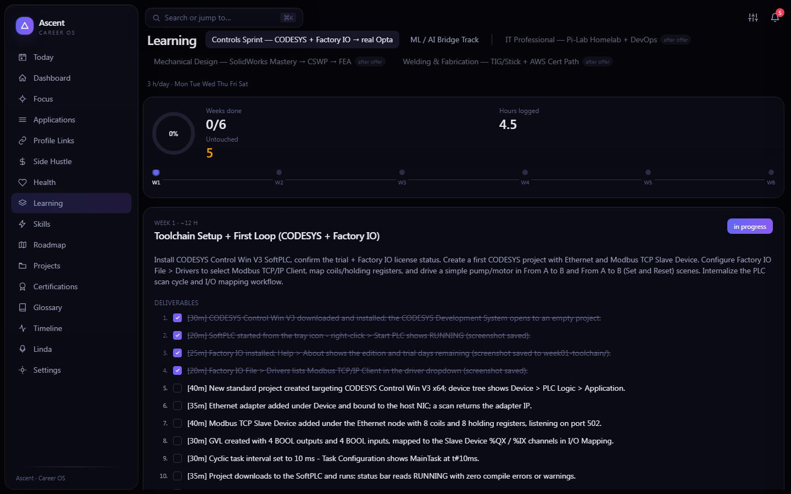
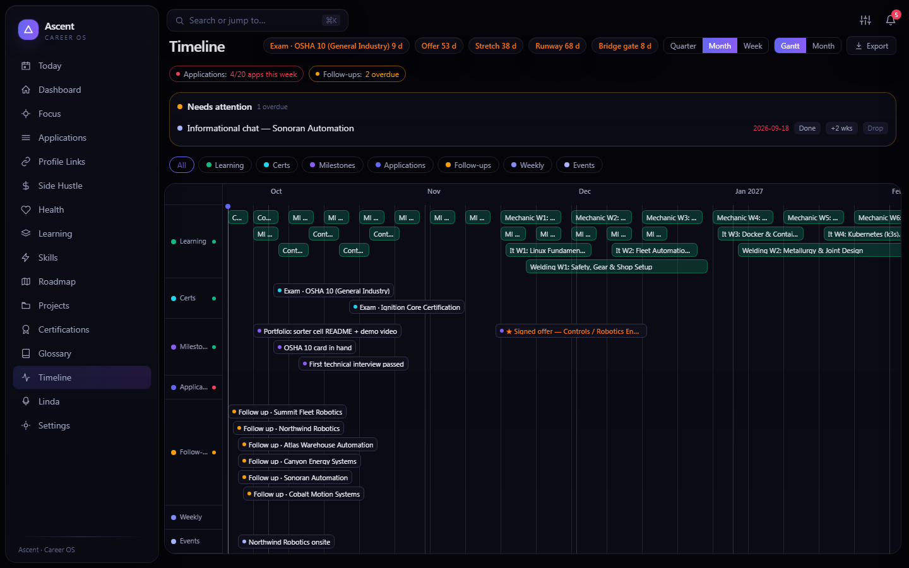
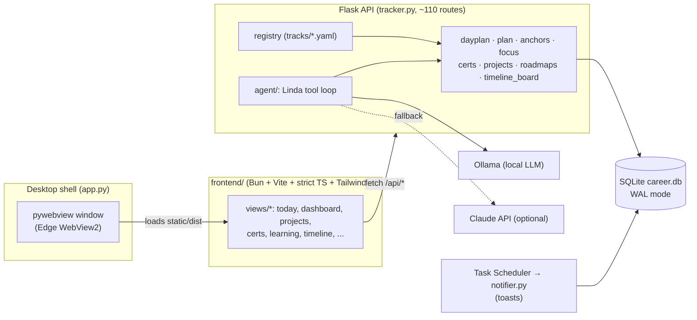

# Ascent — Career OS

**A local-first desktop app that runs a job search like an engineering project: a generated daily plan, a pipeline, learning tracks, certifications and a portfolio checklist, with a local LLM assistant.**

[](https://github.com/aaronk2001/ascent-career-os/actions/workflows/ci.yml)




## Why I built it

A career change has a lot of moving parts: applications and follow-ups, a lab curriculum, certifications with exam dates, portfolio projects that need a README and a resume bullet. Separate spreadsheets and to-do apps drift apart. Ascent keeps everything in one SQLite file and derives the rest from it, so the dashboard, the timeline and the daily plan always agree. It runs on your machine. The assistant uses a local model by default, and no data leaves the laptop unless you enable the Claude fallback.

## Feature tour

| | |
|---|---|
| **Today planner.** Each day is generated from a schedule template and filled from live data: the next deliverable of the active learning week, apps to send, overdue follow-ups, the next cert study step, the next unticked portfolio item. Mark goals done, log actual minutes, and track the week's hour budget per category. |  |
| **Dashboard.** Countdowns to the offer target, stretch date and runway, sprint rings per track, next goals and a pipeline overview. Widgets can be reordered, resized and hidden. A 3D globe plots target companies. |  |
| **Projects.** An inventory of everything you're building, with a five-item ship checklist (repo, README, demo, resume bullet, portfolio) and a three-part interview story per project. *Draft with Linda* proposes story text and a resume bullet that you then edit. Export everything to `PROJECTS.md`. |  |
| **Certifications.** Phase-sequenced roadmap with research verdicts, how-to-get-it notes and step-by-step study plans. Pace math compares remaining study hours with the available 45-minute slots before the exam date. Budget shows active cost against a cap and what is due before the runway ends. |  |
| **Learning tracks.** Curricula are YAML files (`tracks/*.yaml`): weeks, deliverables with minute estimates, "can explain" checks and resources. Tracks include controls (CODESYS + Factory IO) and a 12-week ML/AI bridge track. A scheduler projects each track's end date from the hours per day and weekdays you give it. |  |
| **Timeline.** A unified Gantt of track weeks, cert exams, milestones, applications and follow-ups, with countdown anchors, per-lane health and a triage list of overdue items. Exports to `.ics`. |  |

Also included: a Kanban application pipeline with follow-up automation, a skill-gap and roadmap engine that scores fit against target job profiles, profile-link checklists, a health log, an engineering glossary, a ⌘K command palette, native Windows toasts and an optional one-way Google Calendar push.

**Linda** is a career-only assistant with a tool loop over the app's data. It can read the pipeline, add applications and certs, research a market with Tavily, and analyze an offer. It runs on Ollama by default (`qwen2.5:1.5b-instruct` works on a laptop) and falls back to Claude when `LINDA_BACKEND=auto` and an API key is set.

## Architecture



The backend owns all derived state. For example, `anchors.py` is the single source for headline dates, and `plan.py` projects track end dates without storing them, so a slipped week moves every countdown together. See [docs/ARCHITECTURE.md](docs/ARCHITECTURE.md) for modules, data flow and the schema.

## Tech stack

| Layer | Choice |
|---|---|
| Desktop shell | pywebview (WebView2 on Windows), launched windowless via `ascent.vbs` |
| API | Flask 3, flask-compress, threaded dev server |
| Storage | SQLite (WAL, `synchronous=NORMAL`), YAML for curricula and settings |
| Frontend | TypeScript (strict), Vite 6, Tailwind CSS v4, no UI framework; Three.js globe, Chart.js, GSAP |
| Tooling | Bun (install, typecheck, build), pytest |
| AI | Ollama (local, default), Anthropic Claude (optional fallback), Tavily search |
| Integrations | Windows toast notifications, Google Calendar push, `.docx` resume and cover-letter rendering |

## Quick start

Prerequisites: Python 3.11+, [Bun](https://bun.sh), and optionally [Ollama](https://ollama.com) for Linda.

**Windows**

```powershell
git clone https://github.com/aaronk2001/ascent-career-os.git
cd ascent-career-os
powershell -ExecutionPolicy Bypass -File .\setup.ps1
.\ascent.bat                     # or: .venv\Scripts\python app.py
```

**macOS / Linux**

```bash
git clone https://github.com/aaronk2001/ascent-career-os.git
cd ascent-career-os
./setup.sh
.venv/bin/python app.py          # desktop window; or tracker.py for a browser at :5000
```

On first launch, `career.db` is created with the schema and starter data. Settings fall back to defaults until you save them in the Settings view. For Linda, run `ollama pull qwen2.5:1.5b-instruct`.

## Run the demo

The screenshots come from a fictional demo instance. Build your own:

```bash
python scripts/seed_demo.py      # writes demo/career.db, settings.yaml, profile.yaml, data.yaml
```

The script prints the launch command. It sets environment variables so the app reads the demo folder instead of your data:

```powershell
$env:ASCENT_DB="demo\career.db"; $env:ASCENT_SETTINGS="demo\settings.yaml"; $env:ASCENT_PROFILE="demo\profile.yaml"; $env:TRACKER_DATA="demo\data.yaml"; python app.py
```

If an instance of Ascent is already serving on port 5001, `app.py` reuses it. Close it first, or run `python tracker.py` to use port 5000.

## Configuration

| File / variable | Purpose |
|---|---|
| `.env` (from [`.env.example`](.env.example)) | `LINDA_BACKEND`, `OLLAMA_HOST`, `LINDA_MODEL`, `ANTHROPIC_API_KEY`, `TAVILY_API_KEY`, `EXA_API_KEY`, and path overrides |
| `ASCENT_DB` / `ASCENT_SETTINGS` / `ASCENT_PROFILE` / `TRACKER_DATA` | Point the app at another database, settings file, profile or resume-variant file (used by the demo) |
| `settings.yaml` | Written by the Settings view: model, sprint anchors (offer / stretch / runway / bridge dates), weekly targets, cert budget |
| `profile.yaml` (from [`profile.example.yaml`](profile.example.yaml)) | Your name, market and background for Linda, plus the offer-math baseline and interview-prep lines |
| `data/resume_master.json` (from the `.example`) | The only facts the resume tailor is allowed to use |
| `schedule.yaml`, `tracks/*.yaml` | Day templates and learning curricula |

Personal files (`career.db`, `settings.yaml`, `profile.yaml`, `.env`, `output/`) are gitignored.

## Testing

```bash
python -m pytest tests -q                      # 150 tests, no network or Ollama needed
cd frontend && bun run typecheck && bun run build
```

CI runs both jobs on Ubuntu for every push ([`.github/workflows/ci.yml`](.github/workflows/ci.yml)).

## Project structure

```
app.py            desktop entry: Flask thread + pywebview window, WebView2 guard, --dev (Vite HMR)
tracker.py        Flask API routes
db.py             SQLite schema, idempotent migrations, CRUD
dayplan.py …      domain modules (plan, anchors, focus, certs, projects, roadmaps, health, timeline_board)
agent/            Linda: Ollama + Claude backends, tools, prompts, resume tailor, .docx renderers
frontend/         Bun + Vite + TypeScript SPA → builds to static/dist/
tracks/           learning curricula (YAML)
data/             roadmaps and job profiles (JSON), resume master example
scripts/          seed_demo.py, export_repo.py, benchmarks, Task Scheduler registration
tests/            pytest suite
docs/             architecture notes, Google Calendar setup, screenshots
```

## Engineering notes

- **Idempotent migrations.** `db.init_db()` runs on every start. It creates tables, then adds any missing columns found with `PRAGMA table_info`, then seeds reference data only into empty tables. Old databases upgrade in place and fresh ones need no setup step.
- **WAL + NORMAL sync.** The dashboard fires about 11 concurrent requests, and reminder upserts are frequent. WAL mode with `synchronous=NORMAL` and a 5 s busy timeout keeps those writes from blocking reads.
- **Derived, never stored.** Projected track end dates, countdowns and cert pace are computed on request from the curriculum YAML and the DB, so nothing goes stale when a week slips.
- **Startup work.** YAML goes through libyaml's `CSafeLoader` (the ML track parse dropped from 561 ms to 25 ms). Parsed tracks, settings and schedule are cached by mtime. A background thread pre-warms the glossary (about 7.6 s cold) while WebView2 starts. Hashed Vite assets are served `immutable`. `scripts/bench_launch.py` times the cold path.
- **Single-instance launch.** `app.py` reuses a healthy backend, and if a stale process holds the port it picks a free one. This avoids the "blank window" failure caused by duplicate WebView2 instances.
- **Honest AI.** The resume tailor may only reorder and reword facts from `resume_master.json`, and the keyword report flags any number or metric in the output that it can't trace back to them. The offer analyzer returns `None` instead of guessing when no baseline is configured.

## Roadmap

- Multi-profile support (separate databases per search) from the Settings view
- Packaged Windows build (portable folder with an embedded Python)
- Import applications from ATS exports and job-board CSVs
- More curricula in `tracks/`, and a track editor in the UI

## License

Copyright © 2026 Aaron Karsten. All rights reserved. The source is published for review. No license is granted to use, copy, modify or distribute it without written permission.
