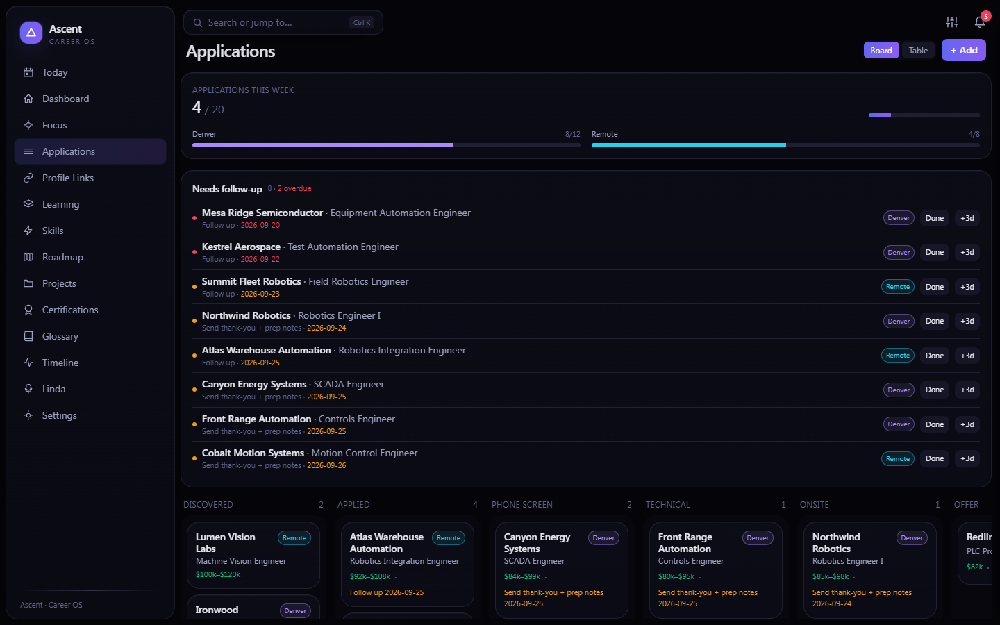
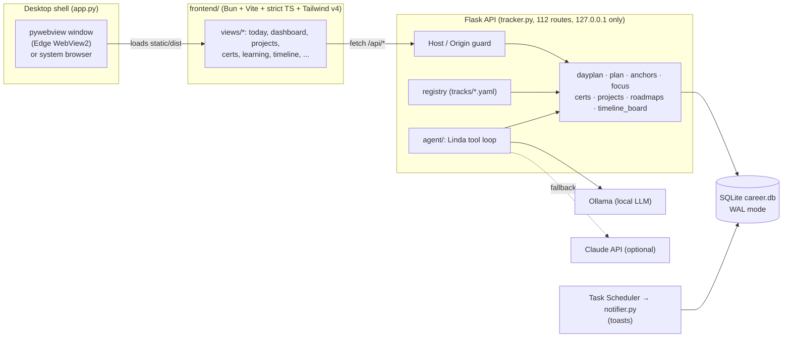

# Ascent — Career OS

**A local-first desktop app that runs a job search like an engineering project: a generated daily plan, an application pipeline, learning tracks, certifications and a portfolio checklist, with a local-LLM assistant.**

[](https://github.com/aaronk2001/ascent-career-os/actions/workflows/ci.yml)


## Why I built it

A career change has a lot of moving parts: applications and follow-ups, a lab curriculum, certifications with exam dates, portfolio projects that each need a README and a resume bullet. Separate spreadsheets and to-do apps drift apart, so Ascent keeps everything in one SQLite file and derives the rest from it, and the dashboard, timeline and daily plan always agree. It runs on your machine, and nothing leaves it unless you turn on the optional Claude fallback.

## Highlights for reviewers

The six places I would look first, with numbers taken from the code and the test suite:

1. **Localhost hardening.** The API has no login; it trusts that only this machine can reach it. Binding to `127.0.0.1` is not enough on its own, because a page in any local browser can still reach it through DNS rebinding or a cross-site form POST. A `before_request` guard ([`tracker.py#L59-L101`](tracker.py#L59-L101)) rejects any non-loopback `Host` and any foreign `Origin` or cross-site `Sec-Fetch-Site`. [`tests/test_routes.py`](tests/test_routes.py) covers 6 rebinding hosts, 4 hostile origins and the allowed dev origins. Draft with Linda only reads files that resolve inside `ASCENT_PROJECTS_ROOT`, symlinks and `..` included ([`projects.py#L179-L185`](projects.py#L179-L185)).
2. **Derived state, never stored.** Headline dates come from one module ([`anchors.py`](anchors.py)), and [`plan.py`](plan.py#L48-L110) projects every track's end date by walking its remaining weeks against the hours per day you set. Nothing is cached in the DB, so a slipped week moves every countdown, the Timeline and Today together.
3. **Schema evolution without a migrations table.** `init_db()` runs on every start: `CREATE TABLE IF NOT EXISTS`, then `PRAGMA table_info` plus `ALTER TABLE ADD COLUMN` for anything missing, then seeds only into empty tables ([`db.py#L374-L440`](db.py#L374-L440)). Old databases upgrade in place. Before shipping this version I ran it against a copy of a real, months-old database: all 19 tables kept identical row counts and content hashes.
4. **Data-driven day planner with feature flags.** A day is a YAML template ([`schedule.example.yaml`](schedule.example.yaml)) whose blocks are filled from live data: the next unticked deliverable of the active week, overdue follow-ups, the soonest cert exam with an open study step. Categories owned by a disabled module are filtered in one place ([`dayplan.py#L51-L72`](dayplan.py#L51-L72)), and the frontend loads the module list before it mounts the nav, so nothing flashes.
5. **Backend-agnostic tool loop.** Linda's 14 tools ([`agent/tools.py`](agent/tools.py#L517)) run unchanged on a local Ollama model or on Claude. Both backends share one loop ([`agent/_loop_common.py`](agent/_loop_common.py)) with a per-tool call cap (3) and an iteration cap (10), and a model that Ollama refuses for lack of RAM is retried on a 1.5B fallback ([`agent/config.py`](agent/config.py#L169)).
6. **Launch engineering.** `app.py` imports pywebview and the Flask app on separate threads so the two slow imports overlap, pre-warms the YAML caches while WebView2 starts, and reuses a running backend only if `/api/instance` reports the same database file ([`app.py#L60-L69`](app.py#L60-L69)). A demo launch can't attach to real data. YAML goes through libyaml's `CSafeLoader` ([`yamlio.py`](yamlio.py)): the 41 KB ML track parses in 3 ms instead of 40 ms with the pure-Python loader (best of 5 on a laptop i5).

**By the numbers:** 183 tests · 112 Flask routes, and a smoke test that requests every GET route (48) on a fresh and on a demo database · strict TypeScript, no UI framework · about 8.3k lines of Python and 7k of TypeScript · CI on Ubuntu and Windows × Python 3.11 and 3.12, plus ruff.

## Quick start

Prerequisites: Python 3.11+, [Bun](https://bun.sh), and optionally [Ollama](https://ollama.com) for Linda.

**Windows**

```powershell
git clone https://github.com/aaronk2001/ascent-career-os.git
cd ascent-career-os
powershell -ExecutionPolicy Bypass -File .\setup.ps1
.venv\Scripts\python app.py --demo     # fictional demo data (demo\, port 5002)
.venv\Scripts\python app.py            # your own data; or .\ascent.bat
```

**macOS / Linux**

```bash
git clone https://github.com/aaronk2001/ascent-career-os.git
cd ascent-career-os
./setup.sh                                   # or: bash setup.sh
.venv/bin/python app.py --demo --browser     # fictional demo data in your browser
.venv/bin/python app.py --browser            # your own data
```

`--browser` serves the app and opens your default browser instead of a native window. On Linux, the native window (`app.py` without `--browser`) also needs pywebview's GTK or Qt bindings, e.g. `.venv/bin/pip install "pywebview[qt]"`. macOS works without extras.

**The demo.** `--demo` seeds a fictional job seeker (Jordan Rivera, Denver) into `demo/` on first run: 12 applications at made-up companies, 6 projects (3 with written interview stories), 6 certs, milestones, skills and this week's plan. It runs on port 5002 and never attaches to an instance serving other data. Dates are relative to the day you seed, so re-run `.venv/bin/python scripts/seed_demo.py` (Windows: `.venv\Scripts\python scripts\seed_demo.py`) to refresh them. All screenshots here come from it.

**Your own data.** On first launch without `--demo`, `career.db` is created with the schema, a generic profile-link checklist and a workout library, and nothing else. Set your offer target and runway dates in Settings to start the countdowns. For Linda, run `ollama pull qwen2.5:1.5b-instruct`.

## Feature tour

| | |
|---|---|
| **Today.** Each day is generated from a schedule template and filled from live data: the next deliverable of the active learning week, apps to send, overdue follow-ups, the next cert study step, the next open portfolio item. Goals run in order, not on a clock. Mark them done, log actual minutes, and track the week's hour budget per category. |  |
| **Applications.** A Kanban pipeline with follow-up automation (first nudge 3 days after applying, a no-reply list after 14 days of silence), weekly targets by bucket, duplicate detection and stage-to-stage conversion. The dashboard above plots the same pipeline on a globe. |  |
| **Projects.** An inventory of what you're building, with a five-item ship checklist (repo, README, demo, resume bullet, portfolio) and a three-part interview story per project. *Draft with Linda* proposes story text from the project's README, which you then edit. Export everything to `PROJECTS.md`. |  |
| **Certifications.** A phase-sequenced roadmap with research verdicts, how-to-get-it notes and step-by-step study plans. Pace math compares the remaining study hours with the 45-minute slots left before the exam. The budget shows active cost against a cap. |  |
| **Learning tracks.** Curricula are YAML files in `tracks/`: weeks, deliverables with minute estimates, "can explain" checks and resources. Five ship with the repo, among them a controls sprint (CODESYS + Factory IO) and a 12-week ML/AI bridge track. A scheduler projects each track's end date from the hours per day and weekdays you give it. |  |
| **Timeline.** One Gantt of track weeks, cert exams, milestones, applications and follow-ups, with countdown anchors, per-lane health and a triage list of overdue items. Exports to `.ics`. |  |

Also included:

- A skill-gap and roadmap engine that scores your fit against target job profiles (`data/job_profiles`), and a Focus page that ranks the next actions.
- Profile-link checklists (LinkedIn, GitHub, portfolio) that feed the Today plan.
- An engineering glossary built from the tracks' vocabulary.
- A Ctrl/⌘K command palette and a customizable, reorderable dashboard.
- Windows toast reminders through Task Scheduler (`scripts/register_tasks.ps1`).

**Optional modules.** Three personal-productivity modules are off by default and can be switched on in Settings: *Side hustle* (income log, bridge-income template), *Clips* (short-form posting goals) and *Health* (weight, workouts, gym goals). When a module is off, its nav entry, Today categories and dashboard tiles are hidden.

**Linda** is a career-only assistant with a tool loop over the app's data. Its 14 tools can read the pipeline, add or update applications, certs, timeline events and weekly tasks, search the web with Tavily, research a job market, analyze an offer, search jobs with Exa, and keep a local vector memory (optional ChromaDB). It runs on Ollama by default (`qwen2.5:1.5b-instruct` fits a laptop) and falls back to Claude when `LINDA_BACKEND=auto` and an API key is set.

**API-only features.** A few backend features have no UI yet and are reachable only through HTTP (or through Linda): resume and cover-letter tailoring to `.docx` (`POST /api/agent/tailor`, `/api/agent/cover-letter`), interview prep, company intel, the offer analyzer, the job scan, and a one-way Google Calendar push of a day's goals ([docs/gcal-setup.md](docs/gcal-setup.md)).

## Architecture



The backend owns all derived state: `anchors.py` is the single source for headline dates, and `plan.py` projects track end dates without storing them. See [docs/ARCHITECTURE.md](docs/ARCHITECTURE.md) for the process model, modules, schema, optional modules and the day planner.

## Tech stack

| Layer | Choice |
|---|---|
| Desktop shell | pywebview (WebView2 on Windows), launched windowless via `ascent.vbs`; `--browser` for any OS |
| API | Flask 3, flask-compress, threaded dev server bound to 127.0.0.1 |
| Storage | SQLite (WAL, `synchronous=NORMAL`), YAML for curricula, templates and settings |
| Frontend | TypeScript (strict), Vite 6, Tailwind CSS v4, no UI framework; Three.js globe, Chart.js, GSAP |
| Tooling | Bun (install, typecheck, build), pytest, ruff, GitHub Actions (Ubuntu + Windows) |
| AI | Ollama (local, default), Anthropic Claude (optional fallback), Tavily and Exa search |
| Integrations | Windows toast notifications, `.ics` export, `.docx` rendering and Google Calendar push (API only) |

## Configuration

| File / variable | Purpose |
|---|---|
| `.env` (from [`.env.example`](.env.example)) | `LINDA_BACKEND`, `OLLAMA_HOST`, `LINDA_MODEL`, `ANTHROPIC_API_KEY`, `TAVILY_API_KEY`, `EXA_API_KEY`, and the path overrides below |
| `ASCENT_DB` / `ASCENT_SETTINGS` / `ASCENT_PROFILE` / `TRACKER_DATA` / `ASCENT_SCHEDULE` | Point the app at another database, settings, profile, resume-variant or template file (`--demo` sets them all) |
| `ASCENT_PROJECTS_ROOT` | Folder that project paths are relative to; Draft with Linda reads only inside it |
| `ASCENT_JOB_RUNS` | Folder of daily job-pull runs (`YYYY-MM-DD/00_summary.md` + per-job folders) shown in Applications |
| `settings.yaml` | Written by the Settings view: model, sprint anchors (offer / stretch / runway dates), weekly targets, optional modules, cert budget |
| `profile.yaml` (from [`profile.example.yaml`](profile.example.yaml)) | Your name, market and background for Linda, the offer-math baseline and interview-prep lines |
| `schedule.yaml` (from [`schedule.example.yaml`](schedule.example.yaml)) | Day templates; written when you save them in Settings |
| `tracks/*.yaml` | Learning curricula |

Personal files (`career.db`, `settings.yaml`, `profile.yaml`, `schedule.yaml`, `.env`, `demo/`, `output/`) are gitignored.

## Testing

```bash
.venv/bin/python -m pytest tests -q        # Windows: .venv\Scripts\python -m pytest tests -q
.venv/bin/ruff check .
cd frontend && bun run typecheck && bun run build
```

The suite has 183 tests and needs no network or model. `tests/conftest.py` points every data path at a temp folder before any app module is imported, so a test run can't touch your data. CI runs the backend on Ubuntu and Windows with Python 3.11 and 3.12, and the frontend typecheck and build on Ubuntu ([`.github/workflows/ci.yml`](.github/workflows/ci.yml)).

## Project structure

```
app.py            desktop entry: Flask thread + pywebview window, --demo / --browser / --dev, instance reuse
tracker.py        Flask API routes + localhost guard
db.py             SQLite schema, idempotent migrations, CRUD
dayplan.py …      domain modules (plan, anchors, focus, certs, projects, roadmaps, health, timeline_board)
agent/            Linda: Ollama + Claude backends, tools, prompts, resume tailor, .docx renderers
frontend/         Bun + Vite + TypeScript SPA → builds to static/dist/
tracks/           learning curricula (YAML)
data/             roadmaps and job profiles (JSON), resume master example
scripts/          seed_demo.py, export_repo.py, a one-off data migration, benchmarks, Task Scheduler registration
tests/            pytest suite
docs/             architecture notes, Google Calendar setup, screenshots
```

About `scripts/`: this repository is generated. I develop Ascent in a private folder next to my real data, and [`scripts/export_repo.py`](scripts/export_repo.py) copies an allowlist of files out, then fails the export if a denylist of personal strings or a secret pattern shows up. [`scripts/migrate_ml_track_v2.py`](scripts/migrate_ml_track_v2.py) is a real one-off data migration, kept as the worked example of the dry-run-by-default, backup-before-apply pattern (its tests are in `tests/test_ml_track_v2.py`).

## Engineering notes

- **WAL + NORMAL sync.** The dashboard fires about 11 concurrent requests, and reminder upserts are frequent. WAL mode with `synchronous=NORMAL` and a 5 s busy timeout keeps those writes from blocking reads.
- **Caching by mtime.** Parsed tracks, settings and the schedule are cached against the file's modification time, so edits are picked up without a restart, and hashed Vite assets are served `immutable`. `scripts/bench_launch.py` times the cold path.
- **Grounded AI output.** The resume tailor (API only) may only reorder and reword facts from `resume_master.json`, and its report lists any number in the output that it can't trace back to them. The offer analyzer returns `None` instead of guessing when no baseline is configured.

## Roadmap

- A small UI for the resume tailor, with untraceable numbers highlighted
- Buttons for the Google Calendar push on Today
- Multi-profile support (separate databases per search) from Settings
- Packaged Windows build (portable folder with an embedded Python)

## License

Copyright © 2026 Aaron Karsten. All rights reserved. The source is published for review. No license is granted to use, copy, modify or distribute it without written permission. See [LICENSE](LICENSE).
