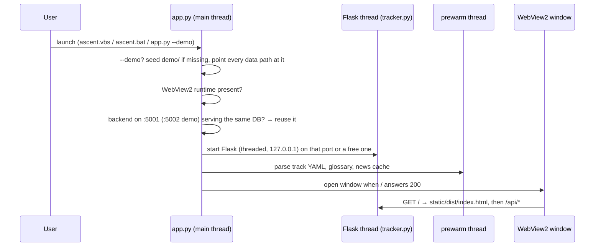

# Ascent architecture

Ascent is a single-user, local-first app with three layers: a pywebview desktop shell, a Flask API over one SQLite file, and a framework-free TypeScript SPA. This document covers how they fit together.

## Process model



- `app.py` imports `webview` on the main thread and `tracker` inside the Flask thread, so the two slow imports overlap.
- Reuse is keyed on the database, not the port: `GET /api/instance` returns the resolved DB path, and `app.py` only attaches to a running backend that serves the same file. A demo launch can never open someone's real data, and vice versa.
- `--dev` (or `ASCENT_DEV=1`) starts `bun run dev` and points the window at Vite on :5173 for hot reload. Vite proxies `/api` to Flask.
- `--browser` skips pywebview: Flask runs in the foreground and the system browser opens. That is the Linux path when the GTK/Qt bindings pywebview needs are not installed.
- `notifier.py` runs outside the app under Windows Task Scheduler (`scripts/register_tasks.ps1`): a morning digest, due checks, and block nudges every 5 minutes.

## Backend modules

| Module | Responsibility |
|---|---|
| `tracker.py` | All HTTP routes (112). Thin: validates input and delegates to domain modules. A `before_request` localhost guard rejects non-loopback `Host` headers (DNS rebinding) and cross-site `Origin`s. Serves `static/dist` with immutable caching for hashed assets. |
| `db.py` | Schema, idempotent `_migrate`, seeding, and CRUD helpers for every table. `DB_PATH` honors `ASCENT_DB`. |
| `registry.py` | Track registry. Each `tracks/<id>.yaml` is one curriculum. Parsed files are cached by mtime and merged with per-week status and details from the DB. |
| `plan.py` | Hour-budget scheduler. It walks each track's remaining weeks day by day, spending `daily_hours` on the listed weekdays. Parked tracks start from the offer date. Nothing is stored. |
| `anchors.py` | Single source of the headline dates: sprint start, offer, stretch, runway, bridge gate, next exam, projected program end, primary-goal milestone. |
| `dayplan.py` | Generates a day's goal list from a `schedule.yaml` template (`weekday`, `saturday`, `bridge_weekday`, `pre_sprint`, …; `schedule.example.yaml` until you save your own). Each category has a filler that pulls live content. Categories owned by a disabled module are skipped. |
| `focus.py` | Next-action ranking: composes skill gaps, roadmap node state, the track cadence and cert progress against the deadline. |
| `certs.py` | Cert pace (study hours left vs 45-minute slots before the exam) and budget math. Shared by Today and Certifications so the two views agree. |
| `projects.py` | Project completeness, the ship checklist, `PROJECTS.md` export, and Linda story drafts. Drafts only read files that resolve inside `ASCENT_PROJECTS_ROOT`. |
| `roadmaps.py` | JSON skill trees (`data/roadmaps`) with live node state, and job-profile gap analysis (`data/job_profiles`). |
| `timeline_board.py` | Collapses every dated item into one Gantt payload with lanes, health and triage. |
| `health.py` | Weigh-ins, workout log, routine streaks, and Mifflin-St Jeor energy targets (optional `health` module). |
| `reminders.py` | Reminder engine shared by the in-app bell and the toast notifier. |
| `gcal.py`, `news.py`, `jobruns.py`, `glossary.py` | Optional Google Calendar push, RSS signal feed, daily job-pull reader, merged engineering glossary. |

### Linda (`agent/`)

- `agent.py` picks the backend from `LINDA_BACKEND`: `ollama`, `claude`, or `auto`. `auto` uses Ollama when it is reachable and otherwise Claude if `ANTHROPIC_API_KEY` is set.
- `_ollama_backend.py` and `_claude_backend.py` run the same tool loop (`_loop_common.py`) over the tool registry in `tools.py`: career state, applications, certs, weekly tasks, timeline, Tavily research, job-market research, offer analysis and RAG memory.
- `prompts.py` builds the system prompt from live pipeline stats and the user's `profile.yaml` (`profile.py`).
- `config.py` manages settings with the precedence *env > settings.yaml > defaults*, including the optional-module flags (`modules()`). `chat_with_fallback` downgrades to a small model automatically when Ollama refuses a model for lack of memory.
- `resume_tailor.py` tailors a resume or cover letter against a job description using only facts from `data/resume_master.json`, and renders `.docx` through `agent/renderers/`.

## Data model (`career.db`)

| Table | Holds |
|---|---|
| `applications` | Pipeline rows: status, bucket, salary range, follow-up automation (`next_action`, `next_action_due`), daily-pull provenance |
| `track_week_status`, `track_progress_detail` | Per-track week status and ticked deliverables, "can explain" items and hours |
| `certifications` | Phase, status, research verdict, `how_to` (JSON), study `steps` (JSON), exam date, cost |
| `projects` | Inventory, story fields (`problem`, `built`, `result`, `pitch`), `ship` checklist (JSON) |
| `day_blocks` | Generated daily goals with status and actual minutes; `gcal_event_id` for idempotent calendar pushes |
| `milestones`, `timeline_events`, `weekly_actions` | Dated goals and events |
| `skill_gaps`, `roadmap_progress` | Proficiency model and skill-tree node state |
| `profile_links`, `side_log`, `health_day`, `workouts`, `notes`, `reminders` | Supporting sections |
| `controls_progress`, `ml_progress` | Legacy tables, backfilled into `track_week_status` by the migration |

Conventions: text primary keys with a type prefix (`app_…`, `cert_…`, `proj_…`), ISO `YYYY-MM-DD` dates as text, and JSON in text columns for small nested structures. The connection sets `synchronous=NORMAL` and `busy_timeout=5000`. `init_db` sets `journal_mode=WAL` persistently.

### Migrations

`init_db()` runs on every start:

1. `CREATE TABLE IF NOT EXISTS` for the full schema.
2. `_migrate`: for each evolving table, `PRAGMA table_info` then `ALTER TABLE ADD COLUMN` for anything missing, then a legacy backfill with `INSERT OR IGNORE`.
3. Seeds (a generic profile-link checklist and the workout library) only run on empty tables. Nothing personal is seeded: the project inventory starts empty.

Every step is safe to repeat, so there is no migration version table. Larger one-off data changes live in `scripts/` as dry-run-by-default scripts that back up the DB before `--apply` (see `migrate_ml_track_v2.py` and its tests).

## Day-plan generation

```
schedule.yaml template ──► dayplan.generate(day)
   │                           │  template_name(): pre_sprint / weekday / saturday / sunday / bridge_weekday
   │                           ▼
   │                     for each entry → _fill(cat):
   │                        controls / ml   → registry: next unticked deliverable of the current week
   │                        apps / outreach → settings.daily_apps, overdue follow-ups
   │                        cert            → certs.next_study_cert(): soonest exam with an open step
   │                        portfolio       → earliest-due open profile link
   │                        project         → closest-to-shipped core project, next unticked item
   ▼                           ▼
week_summary()  ◄──── day_blocks rows (status, actual_min)
```

Generation is idempotent per date. Regenerating keeps completed blocks and replaces the rest. When a category appears twice in a template (two controls blocks, say), the second block points at the next deliverable after the first one's, so the goals never repeat.

## Optional modules

`settings.yaml` → `modules: {side, clips, health}` (all off by default, toggled in Settings). One flag gates everything a module owns:

| Module | Nav | Today categories | Dashboard |
|---|---|---|---|
| `side` | Side Hustle | `bridge` (and the `bridge_weekday` template editor) | revenue tile |
| `clips` | — | `clips` | posts tile |
| `health` | Health | `gym` | — |

The backend filters `dayplan.active_cats()` (generation, `/api/day`, `/api/day/week`); the frontend loads `/api/modules` once before mounting the shell so the nav never flashes hidden items.

## Learning-track registry

A track file declares `title`, `started`, `active`, `daily_hours`, `days` and `weeks[]`. Each week carries an `objective`, `deliverables` (each prefixed with a `[NNm]` estimate), `can_explain`, `vocab`, a `primary_resource` and `est_hours`. Adding a curriculum means adding a YAML file. The Learning view, Today fillers, Timeline lanes and `plan.py` projections pick it up with no code change.

## Frontend

- `router.ts`: hash router with lazily imported views (`#/today`, `#/dashboard`, `#/projects?open=<id>`, …).
- `api.ts`: typed fetch wrapper. Views are plain functions that return `{ render, cleanup }`.
- `style.css`: Tailwind v4 theme tokens for the dark design system. `motion.ts` and `visuals.ts` respect `prefers-reduced-motion`.
- Build: `tsc --noEmit && vite build` emits hashed chunks to `static/dist/`.

## Tests

`tests/` covers the day planner (including module gating), cert pace and budget, projects and the Draft path confinement, the demo seed, health math, the ML-track migration (dry run vs apply, idempotency), cache invalidation, the profile, env-override and offer baselines, the localhost guard, and a route smoke test that requests every GET route on a fresh and on a demo database. `tests/conftest.py` points every data path at a temp folder before any app module is imported, and each test also gets its own DB by monkeypatching `db.DB_PATH`. Nothing touches the network or a model.
